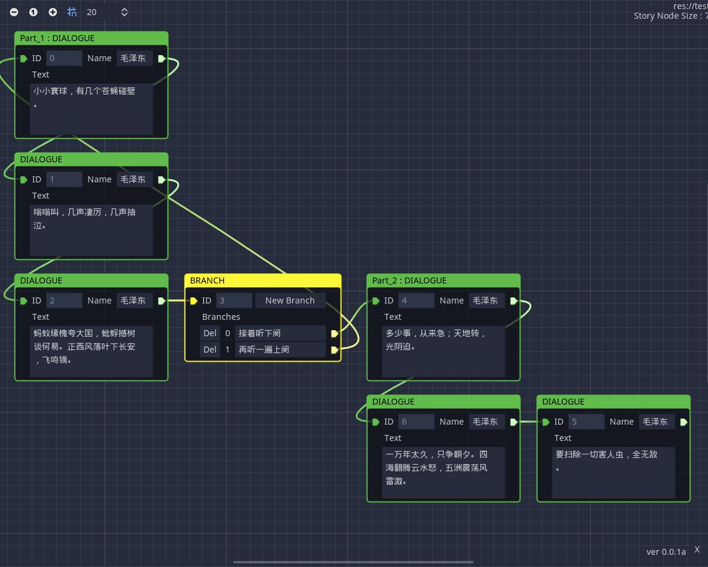
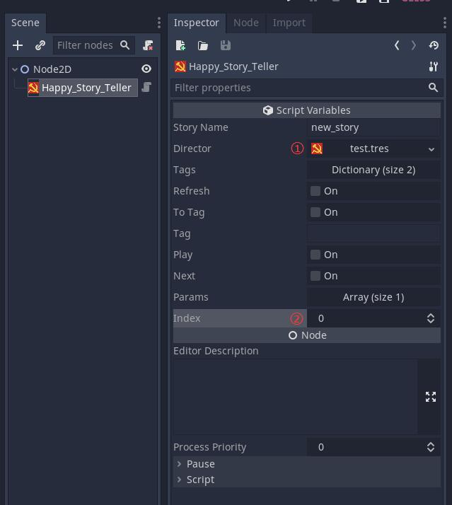

# Happy Story Designer

这是一个简陋可用版本的Godot项目剧情编辑器插件，目前只包含了对话与分支选项功能。

## 安装步骤

* 将该插件的可用版本克隆或下载解压至项目的addons文件夹中；
* 打开项目，在【Project】→【Project Setting】→【Plugins】中，将HappyStoryDesigner的状态更改为Enable。

## 使用步骤

* 在需要添加剧情的场景中创建Happy_Story_Teller节点；

    必须要设置的参数：

     ① director：作为装填故事内容的容器的Happy_Director资源，可以在FileSystem中添加再挂载到Director参数上，也可以直接在Director参数上作为场景内建资源新建；
     
     ② index： 用节点ID表示播放进度的参数，请一定将场景中的Index设置为起始剧情节点的ID（如果设置了Tag参数，则无所谓Index初始被设为什么，都会以设定了该Tag的剧情节点为起始剧情）。

* 在Scene中选中已挂载Director的Happy_Story_Teller，然后点击下方dock中的Happy Story Designer标签，即可打开对应Director的图形编辑器

## Tag功能

Tag是快速定位剧情的功能。可以通过字符串快速将播放进度定位到与该字符串相同的Tag的剧情节点上。

在剧情节点上【右键】→【Set Tag】添加，同一个Director中不能有重复的Tag。已有Tag的剧情节点，可以通过【Set Tag】重设Tag。

## Happy_Story/剧情节点
所有剧情节点的父类。

### Happy_Dialogue/对话节点
#### 属性

    String speaker
说话人的名字

    String text
说话的内容

### Happy_Branch/分支节点
#### 属性

    Dictionary branches
Key 为分支选项的序号，Value 为分支选项的文字内容。

## Happy_Story_Teller

    Happy_Story play() 

打印ID为 index 的剧情节点的内容，并将该剧情节点作为返回值返回。

    Happy_Story play_with_index(var _index : int)

将 index 改为 _index，并返回 Play() 函数。

    Happy_Story next(var params : Array = [0])

将 index 改为目前的剧情节点所指向的下一个剧情节点的ID，并将后者作为返回值返回。

参数params 为分支选项的序号，不填时默认为0。

    Void to_tag(var temp_tag = tag)

将 index 改为标签为 temp_tag 的剧情节点的ID